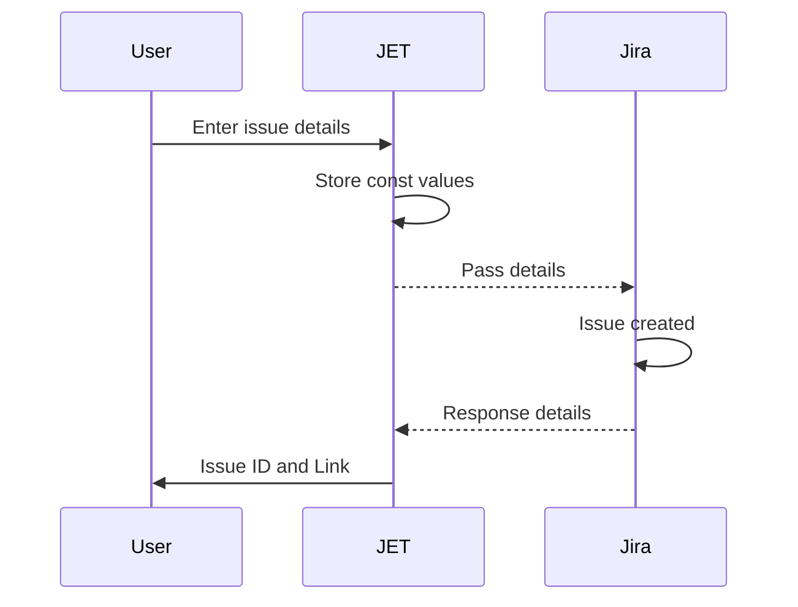

# JET (Jira Easy Tasks) web form
JET (Jira Easy Tasks) is a simple web utility that streamlines the creation of Jira tickets for basic and repetitive engineering tasks. JET eliminates the need to log in to Jira and manually fill in all the necessary Jira fields every time you create a ticket, making the task creation process efficient and hassle-free.

## Features

### Easy ticket creation
HCC engineers can quickly enter the required details for creating a common Jira ticket. It only requires a quick one-line summary of the task and the selection of one of the four available common task types you're creating. 

> Optional: Add your Jira username and the ticket will be assigned to you upon creation. 

Once submitted, you'll receive a response with the Ticket ID and URL for reference. 

### Task type selection
JET has a quick selection for common Jira types. This ensures that the created tickets are labeled and named correctly. The follow task types are available:
 - General
 - Maintenance
 - Merge requests
 - Toil

### Integration with Jira
JET integrates with issues.redhat.com, utilizing the Jira REST API to create and store the tickets. All created tickets will be directly accessible and visible within the RHCLOUD project. Created tickets have the following details associated with them:
 - Jira Username = `Assignee`
 - Summary = `Summary`
 - Ticket Type = `Label` and used in the `Summary`
 
 Default values for all tasks:
  - Project Key = `RHCLOUD`
  - Issue Type = `Task`
  - Priority = `Normal`
  - Label = `Platform-devprod`

### View JET Tasks
- [New Tasks](https://issues.redhat.com/issues/?filter=12416461)
- [Refinement and Backlog Tasks](https://issues.redhat.com/issues/?filter=12416463)
- [In Progress Tasks](https://issues.redhat.com/issues/?filter=12416462)

### Sequence overview

